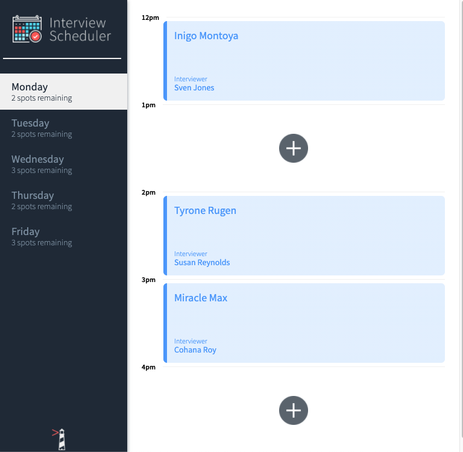

# Interview Scheduler

**Interview Scheduler** is a single page application that allows users to select and book an appointment with an interviewer during available time slots throughout the week.

It was built using **React** and employed a TDD approach with testing frameworks like **Storybook**, **Jest**, and **Cypress**.

---
### View the current appointments and available time slots.


### Book a new appointment with the interviewer of your choice.


### Edit or delete an appointment.


### Replace the old appointment with a new one.


---

## Setup

Install dependencies with `npm install`.

## Running Webpack Development Server

```sh
npm start
```

## Running Jest Test Framework

```sh
npm test
```

## Running Storybook Visual Testbed

```sh
npm run storybook
```

## Interview Scheduler API

The API server can be found at:

https://github.com/lighthouse-labs/scheduler-api

---

## Technical Specifications
- React
- Webpack, Babel
- Axios
- Storybook, Jest, Cypress, Testing Library